# Telegram 私聊转发机器人（PM Forwarder Bot）

> [!Caution]
> **本项目不再维护**
>
> 推荐查看另一个基于 CloudFlare Worker 的项目 **[fork-telegram_private_chatbot](https://github.com/ReRokutosei/fork-telegram_private_chatbot)**

> [!TIP]
> 相对于 [原项目（1ad5a1b）](https://github.com/ReRokutosei/fork-tg-pm-bot/commit/1ad5a1b2091dc5004db6e317308cd15986d2337c)，本 fork **主要变更**
> - 引入简单的数学验证防骚扰
> - 为消息编辑映射添加 24 小时自动清理
> - 移除“已发送”提示，仅失败时反馈
> - 自动恢复被误删除的用户话题（也不再会落入 General）
> - 简化 Dockerfile 的 pip 安装命令
> - 整理项目目录结构
> - 添加 MIT 许可证
> - 将文档图片改为文件引用，并补充部分文档说明

本项目是基于 Python 的 Telegram 机器人。其核心目标是将用户对机器人的私聊消息自动转发至指定管理群，并支持在管理群内对该用户进行直接回复。该模式近似于轻量级客服工单系统，适用于需要集中管理私聊会话的场景。

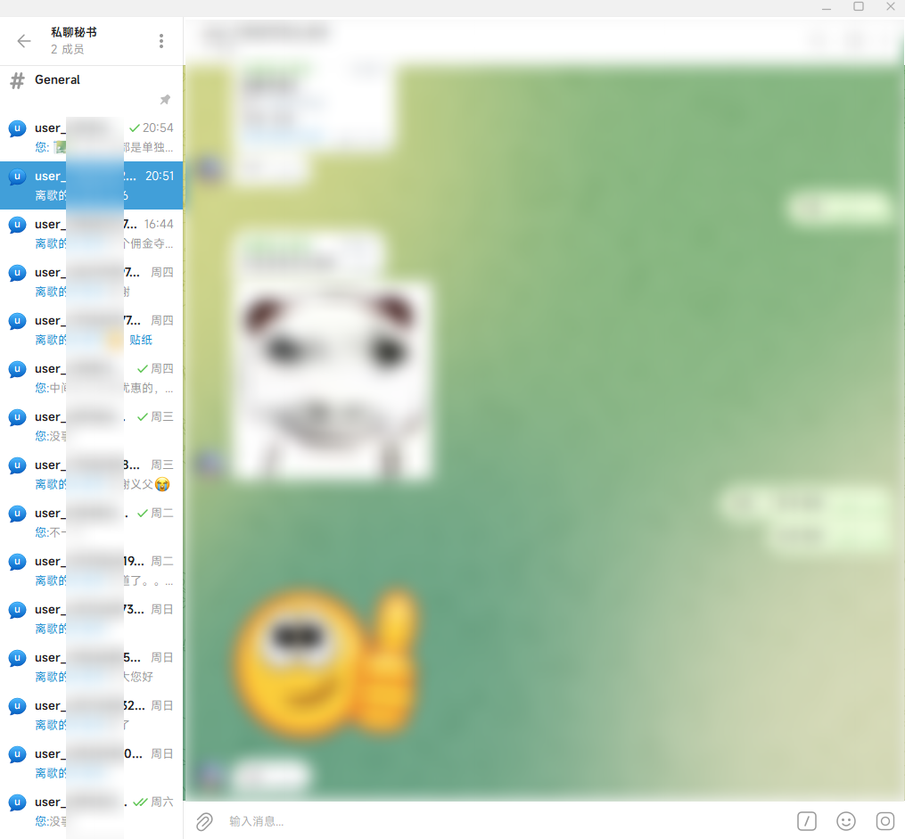

---

## 功能概述

- 私聊消息自动转发至管理群，支持文本、图片、视频、贴纸与文件。
- 基于话题模式为每个用户创建独立话题，避免会话混杂。
- 管理群话题内消息可自动转发回用户私聊，无需显式引用或回复。
- 新用户首次创建话题时自动发送用户信息摘要。
- 可选的访问验证机制：固定口令或数学验证码（数学验证码优先）。
- 管理员可封禁与解封指定用户。
- 话题映射支持持久化，重启后可恢复。
- 可选的消息编辑同步（仅在运行期内且映射未过期时生效）。

---

## 工作机制

1. 用户私聊机器人并发送消息。
2. 机器人在管理群创建用户对应的话题，并将消息转发至该话题。
3. 管理员在该话题内发送消息，机器人将其转发回用户私聊。
4. 机器人定期进行话题健康检查；若话题失效将自动重建并修复映射。

注意：上述机制依赖 Telegram 群组的“话题模式（Forum Topics）”。请确保管理群已启用该功能。

---

## 事先准备

### 1）创建机器人并获取 Token（BOT_TOKEN）

在 Telegram 中联系 @BotFather：

1. 发送 `/newbot`。
2. 按提示设置机器人名称与用户名。
3. 获取 `BOT_TOKEN`。

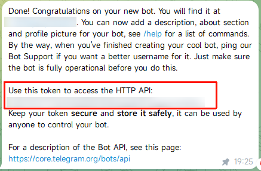

---

### 2）创建管理群并获取 GROUP_ID

1. 创建一个私有群组（建议仅包含你与机器人）。
2. 将机器人加入群组并授予管理员权限。
3. 在群组设置中启用“话题模式（Forum Topics）”。

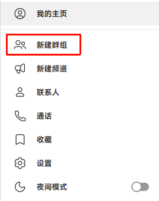
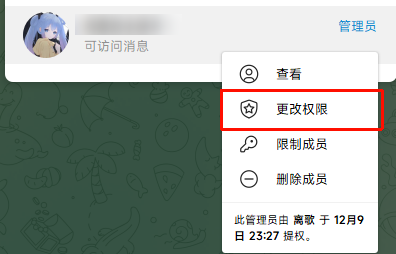
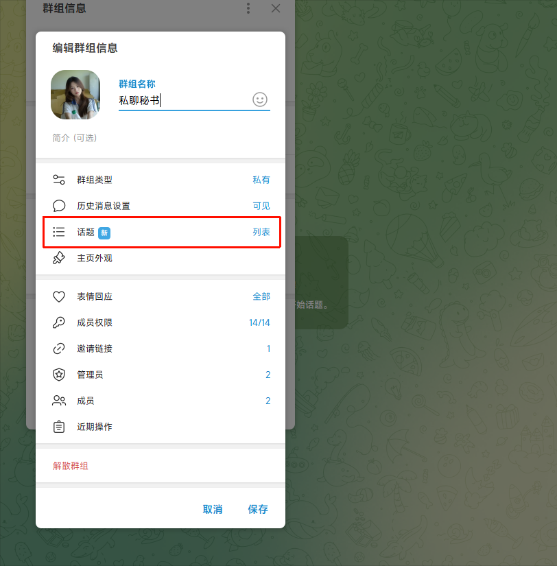

#### 获取群组 ID 的方法

方法 A（Windows 客户端） 

在 Windows 客户端打开群组信息页即可看到群组 ID（需要手动添加 `-100` 前缀），例如 `-100113320xxxxx`。

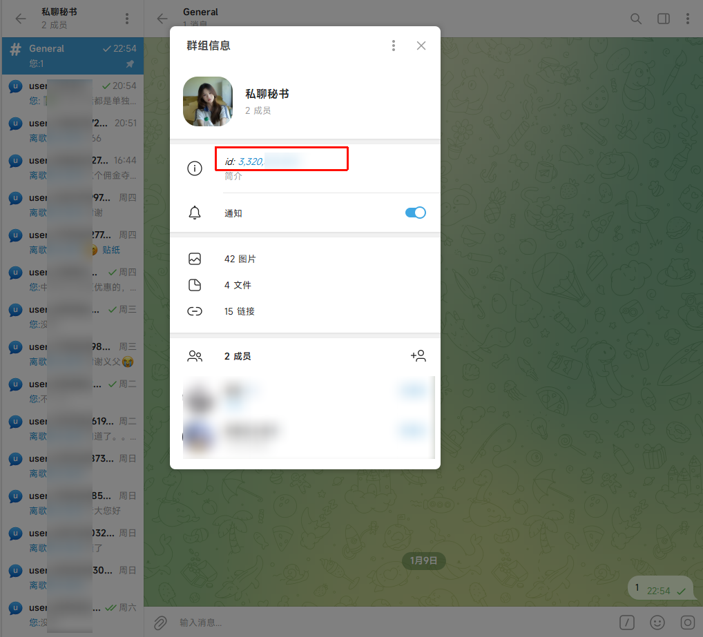

方法 B（第三方客户端） 

第三方客户端可以直接看到群组ID。安卓端可使用 Nagram X，Windows端推荐 AyuGram

方法 C（通过 /id 命令） 

邀请临时机器人进入群组并发送 `/id`，即可显示群组 ID。

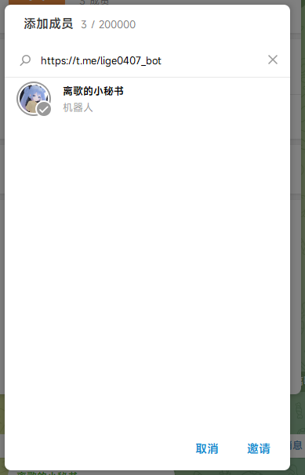
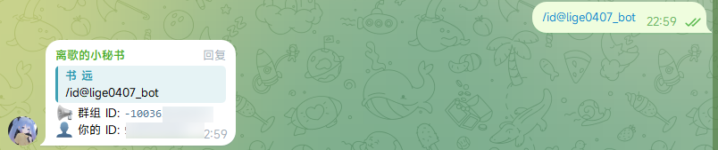

---

## Zeabur 部署指南

### 1）Fork 本项目
将本仓库 Fork 至你的 GitHub 账号。

### 2）在 Zeabur 创建项目
[点击登录 Zeabur](https://zeabur.com/referral?referralCode=ReRokutosei&utm_source=ReRokutosei&utm_campaign=oss)，依次执行：

1. Create New Project
2. 选择共享集群
3. 创建项目

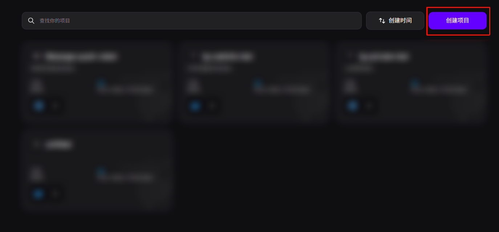
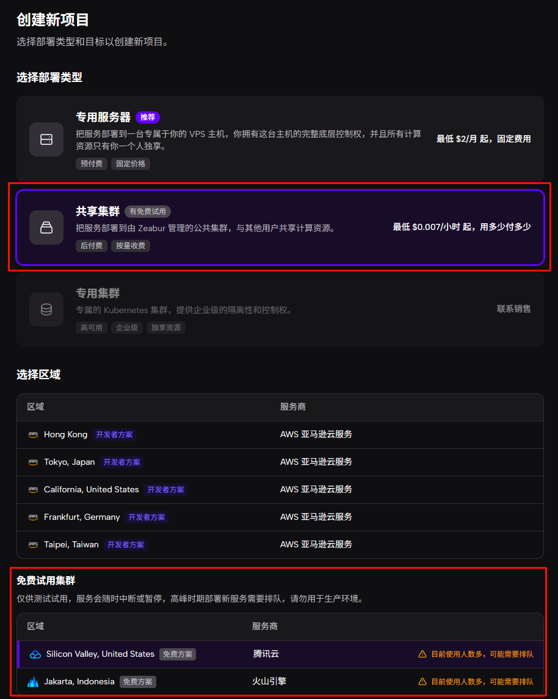

### 3）部署服务
在项目中选择“部署新服务”并从 GitHub 选择 Fork 的仓库。

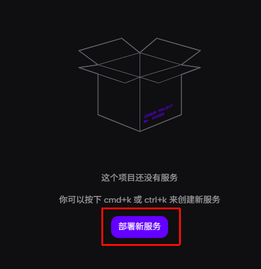
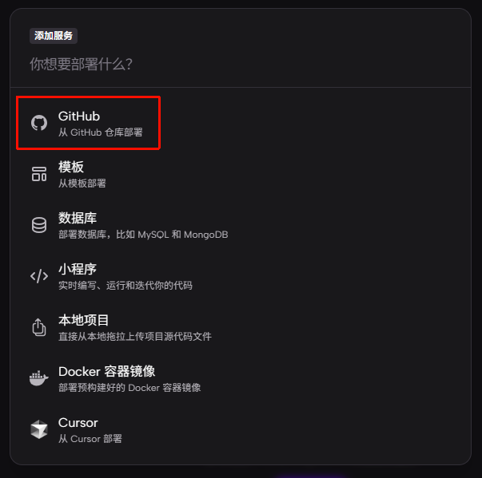
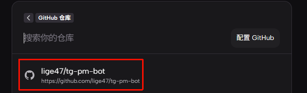

### 4）配置环境变量
进入服务配置页，按用途填写变量。可以分为“必填项”和“可选验证项”两类。

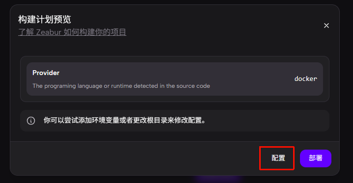

必填项（必须填写）：
- `BOT_TOKEN`  
  这是你在 @BotFather 创建机器人时获得的 Token。它用于让程序以该机器人的身份连接 Telegram。
- `GROUP_ID`  
  管理群的 ID，必须带 `-100` 前缀。该 ID 表示机器人要把用户消息转发到的目标群组。

可选验证项（按需选择其一或不启用）：
- 固定口令验证  
  用于限制只有知道口令的人才能与机器人对话。这里的“口令”是你自定义的访问密码，不是任何平台账号密码。  
  - `VERIFY_QUESTION`：展示给用户的提示问题，例如“请输入访问密码：”，或者随意定制“请输入【我是一个小可爱】”。  
  - `VERIFY_ANSWER`：你设置的口令答案，例如 `4399`，`我是一个小可爱`。  
  只要设置了 `VERIFY_ANSWER`，固定口令验证即被启用。
- 数学验证码验证  
  用于通过简单计算题过滤机器人滥用。  
  - `USE_MATH_CAPTCHA`：设为 `true` 即启用。

验证规则：
- 固定口令与数学验证码二选一即可。
- 若两者同时设置，数学验证码优先生效。
- 若两者都不设置，则不进行验证。

### 5）部署
点击“下一步”并执行部署，显示运行中即表示部署完成。

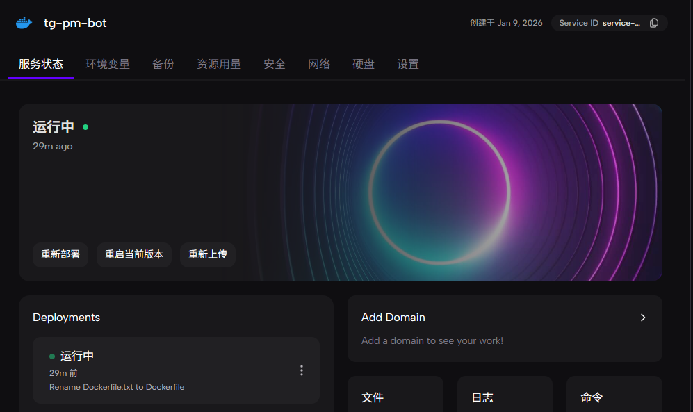

### 6）修改简介
将机器人的用户名放入你的 Telegram 账号简介，例如 `@My-bot`。  
注意在 `@` 前增加一个空格。

### 7）设置容器监控路径（可选）
在 Zeabur 项目设置页，将“监控路径”设置为 `/src`。  
设置后，文档类变动不会触发重新构建。

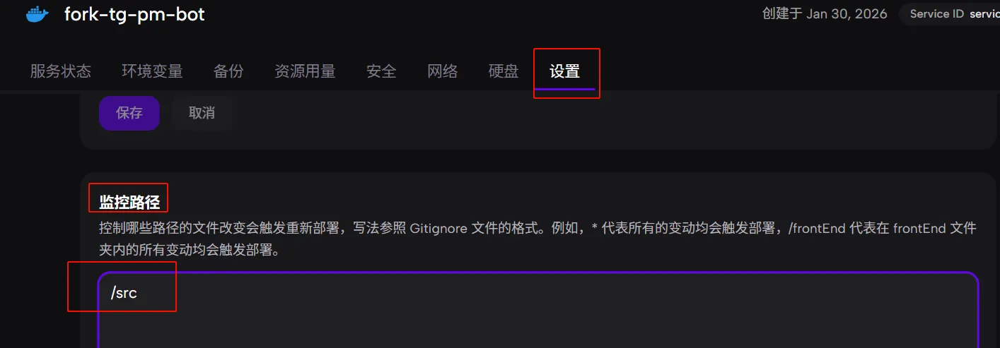

---

## 数据持久化（强烈建议）

为避免重启后丢失“用户 ↔ 话题”映射，建议挂载数据卷：

1. 在 Zeabur 服务页面点击“硬盘”。
2. 点击“挂载硬盘”。
3. 硬盘名设为 `data`。
4. 挂载目录设为 `/data`。

映射文件默认保存于 `/data/topic_mapping.json`。

---

## 快速测试

在管理群中发送：
- `/id`：查看群组 ID 与话题 ID（若在话题内）。

在用户私聊中测试：
- `/start`：确认验证机制是否生效。
- 发送一条消息：应自动出现在管理群对应话题。
- 在话题内发送消息：应自动回传到用户私聊。

---

## 管理命令

- `/id`
  - 私聊：显示用户 ID。
  - 群组：显示群组 ID 与话题 ID。
- `/ban <user_id>`
  - 封禁指定用户。
  - 亦可在该用户话题内直接执行 `/ban`（无需参数）。
- `/unban <user_id>`
  - 解封指定用户。
  - 亦可在该用户话题内直接执行 `/unban`。
